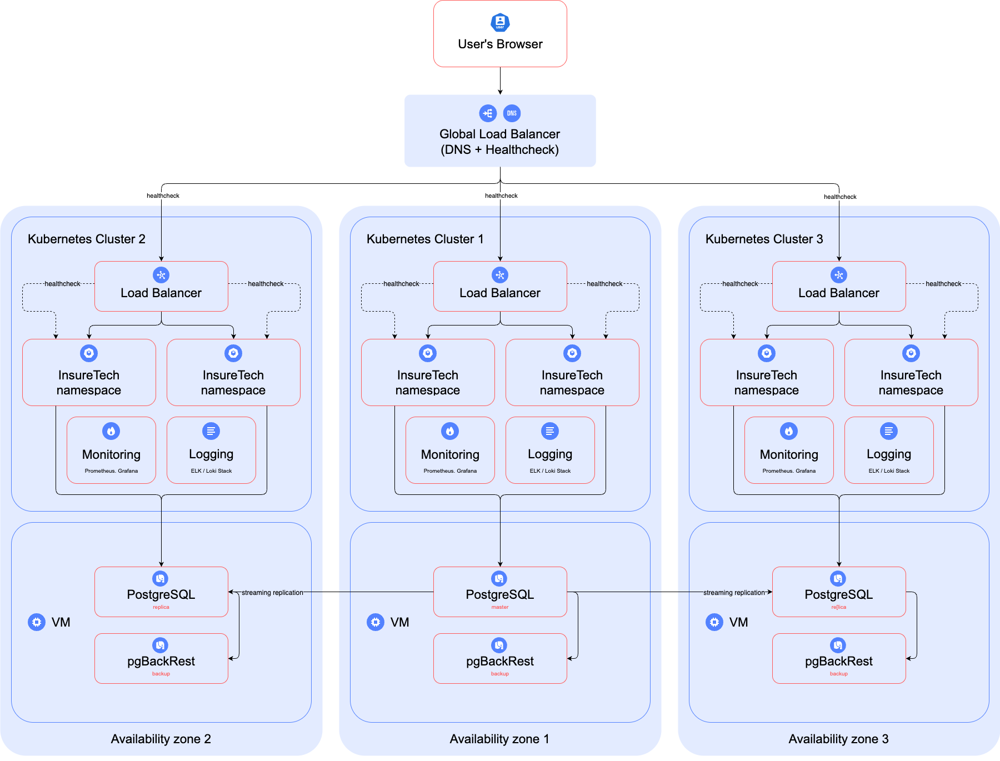

# Task1 — Технологическая архитектура InsureTech

## Описание решения

В рамках данного задания спроектирована отказоустойчивая геораспределённая архитектура для InsureTech с учётом требований:

- Доступность: 99.9%
- RTO ≤ 45 минут
- RPO ≤ 15 минут

Ключевые особенности:

- Развертывание в 3-х зонах доступности.
- Независимые Kubernetes кластеры в каждой зоне.
- Балансировка нагрузки через Global Load Balancer (DNS + Healthcheck).
- PostgreSQL: 1 master + 2 streaming replica.
- Репликация данных между зонами.
- pgBackRest — для резервного копирования.
- Логирование: Loki Stack / ELK.
- Мониторинг: Prometheus + Grafana.
- Все компоненты мониторинга и логирования — внутри кластеров.

## Схема архитектуры

Файл схемы:
[Схема технологической архитектуры InsureTech](./InsureTech_architecture_to-be.drawio)

Превью схемы:

