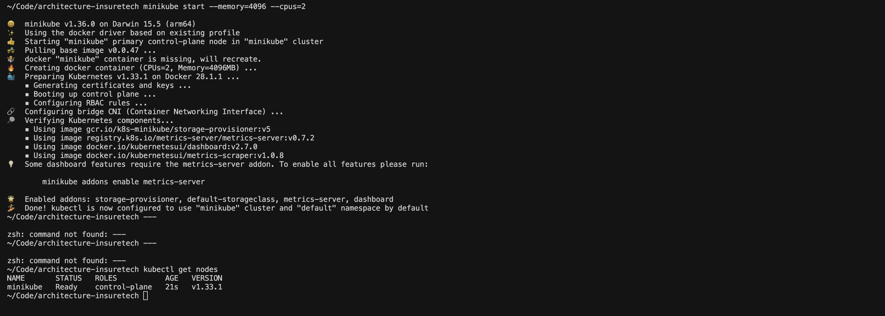
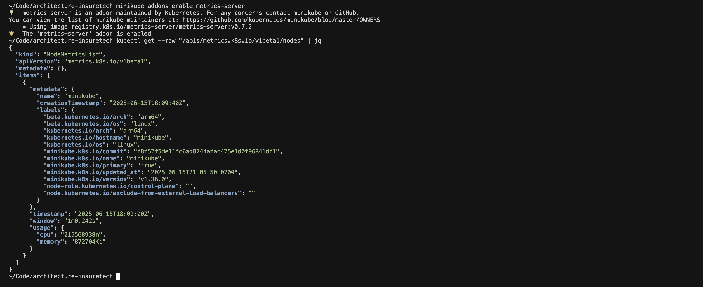
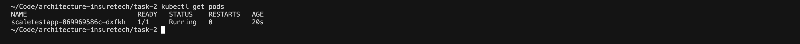
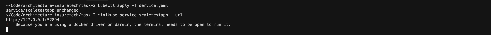
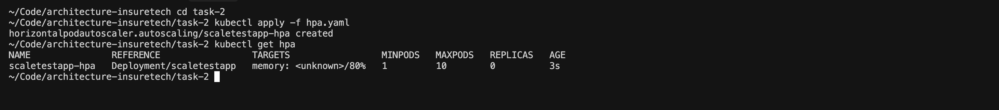
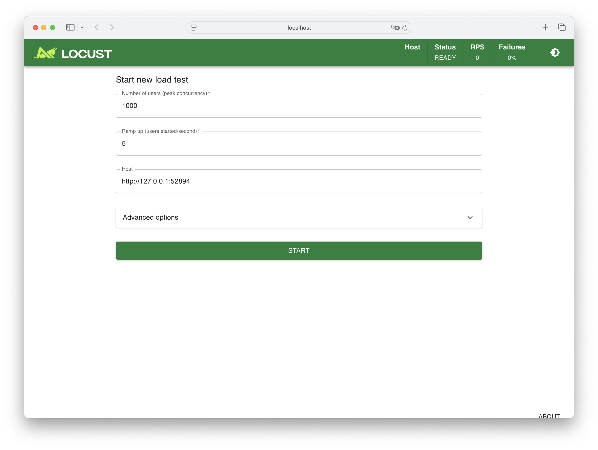
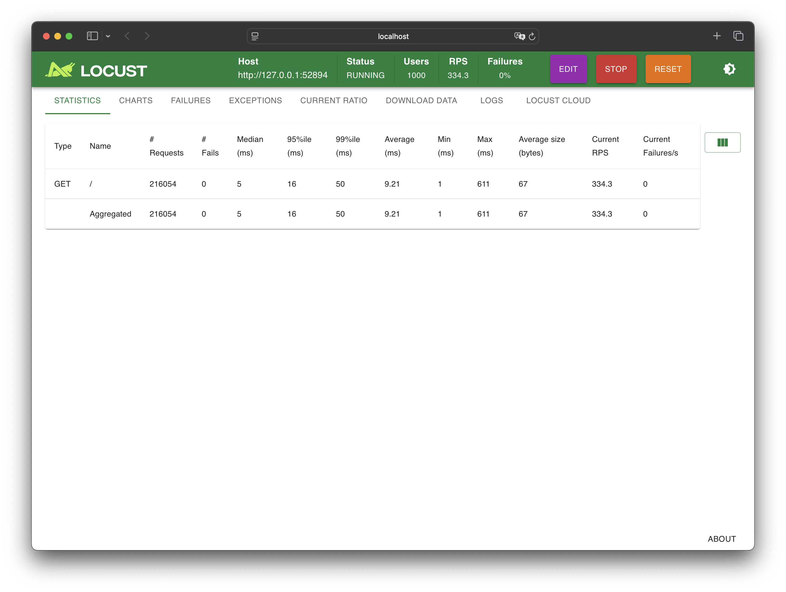
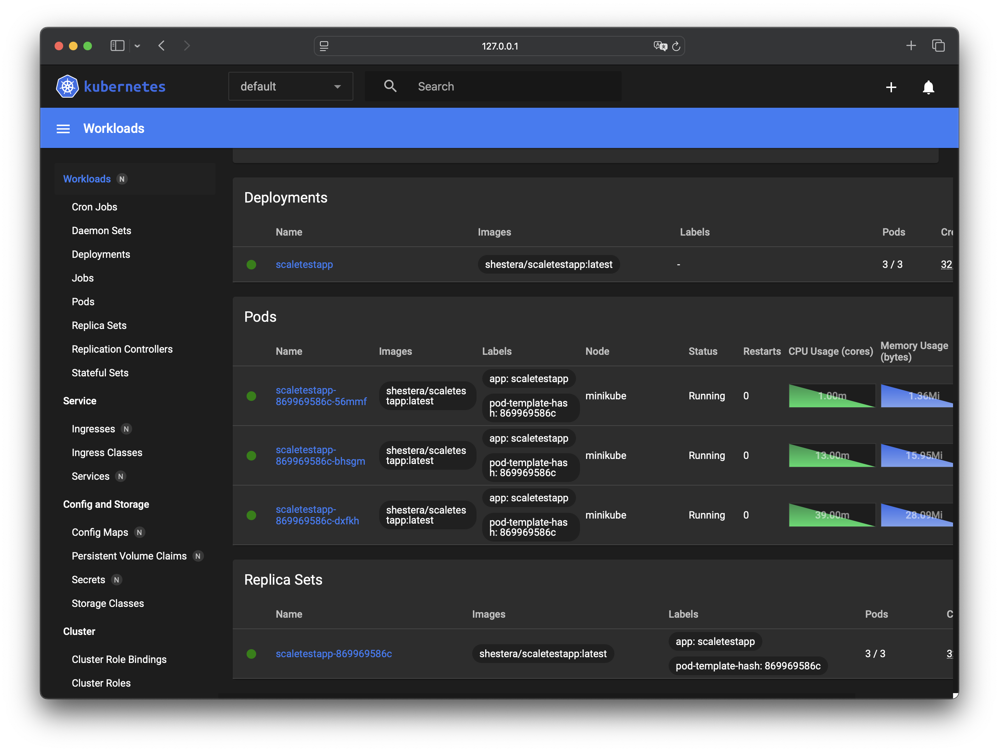

# Task2 — Динамическое масштабирование в Kubernetes

## Описание решения

В рамках задания настроено автоматическое масштабирование приложения в Kubernetes на основе потребления оперативной памяти (Horizontal Pod Autoscaler по Memory).

Для выполнения задания были выполнены следующие шаги:

- Запущен локальный кластер Kubernetes в Minikube.
- Активирован `metrics-server` для сбора метрик.
- Развернуто тестовое приложение `shestera/scaletestapp:latest` через Deployment.
- Создан Service для доступа к приложению.
- Настроен Horizontal Pod Autoscaler (HPA):
  - таргет по памяти: 80%
  - минимальное количество реплик: 1
  - максимальное количество реплик: 10
- С помощью Locust сгенерирована нагрузка на приложение.
- Подтверждено масштабирование количества реплик в зависимости от нагрузки.

## Файлы в директории

- `deployment.yaml` — манифест Deployment для приложения.
- `service.yaml` — манифест Service.
- `hpa.yaml` — манифест Horizontal Pod Autoscaler.
- `locustfile.py` — скрипт для генерации нагрузки.
- Скриншоты или логи — подтверждение работы масштабирования.

## Образ тестового приложения

Используется официальный учебный образ:

```
shestera/scaletestapp:latest
```

Он доступен на Docker Hub:  
https://hub.docker.com/r/shestera/scaletestapp

## Решение по шагам

### Шаг 1 — Запуск Minikube

- Запущен кластер Minikube с параметрами:

```bash
minikube start --memory=4096 --cpus=2
```

- Проверка работоспособности:

```bash
kubectl get nodes
```

**Скриншот №1:** состояние кластера после запуска (`kubectl get nodes`)



---

### Шаг 2 — Установка и настройка metrics-server

- Включён metrics-server:

```bash
minikube addons enable metrics-server
```

- Проверка метрик:

```bash
kubectl get --raw "/apis/metrics.k8s.io/v1beta1/nodes" | jq
```

**Скриншот №2:** успешный вывод метрик



---

### Шаг 3 — Развертывание тестового приложения

- Создан `deployment.yaml` для тестового приложения

- Применено:

```bash
kubectl apply -f deployment.yaml
```

- Проверка:

```bash
kubectl get pods
```

**Скриншот №3:** список запущенных подов



---

### Шаг 4 — Создание Service

- Создан `service.yaml`:

- Применено:

```bash
kubectl apply -f service.yaml
```

- Получен URL сервиса:

```bash
minikube service scaletestapp --url
```

**Скриншот №4:** адрес сервиса


---

### Шаг 5 — Настройка Horizontal Pod Autoscaler

- Создан `hpa.yaml`:

- Применено:

```bash
kubectl apply -f hpa.yaml
```

- Проверка состояния HPA:

```bash
kubectl get hpa
```

**Скриншот №5:** состояние HPA


---

### Шаг 6 — Генерация нагрузки через Locust

- Создан `locustfile.py`:

- Запуск Locust:

```bash
locust
```

- Открыт интерфейс Locust:

```
http://localhost:8089
```

- Введены параметры нагрузки (например, 1000 пользователей и 5 RPS)

**Скриншот №6:** интерфейс Locust после запуска нагрузки





---

### Шаг 7 — Наблюдение за масштабированием

- Мониторинг изменений через Minikube Dashboard:

```bash
minikube dashboard
```

**Скриншот №7:** динамическое изменение количества реплик



---
