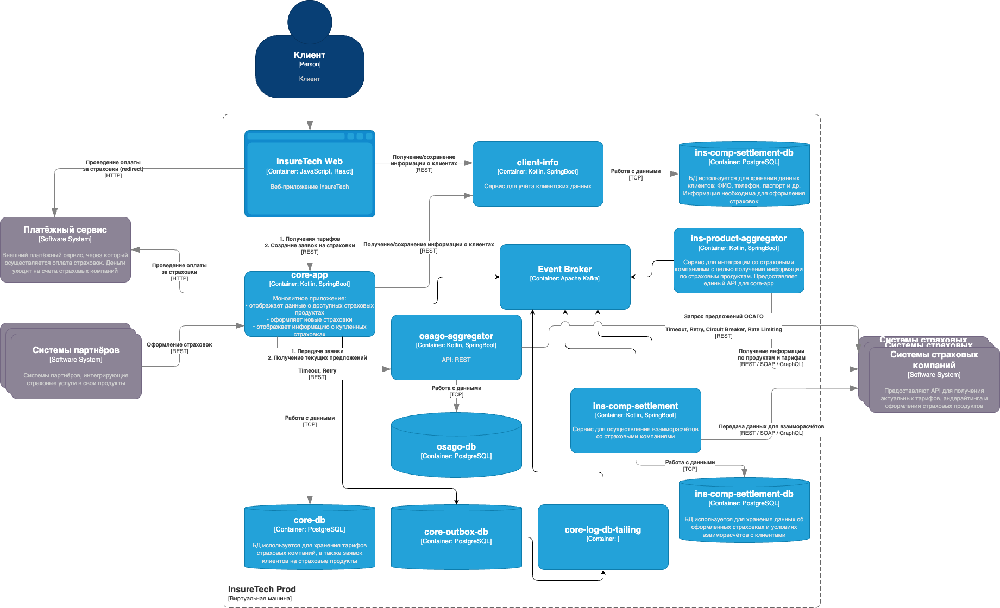

# Task4 — Проектирование продажи ОСАГО

## Архитектурное решение

В рамках задачи спроектировано расширение архитектуры InsureTech для поддержки оформления полисов ОСАГО. Основная цель — обеспечить получение предложений от страховых компаний в режиме реального времени (по мере поступления), с высокой отказоустойчивостью.

---

## 1. Общая логика взаимодействия

### Компоненты:

- **core-app** — главный сервис бизнес-логики, обрабатывает заявки клиентов, управляет жизненным циклом оформления ОСАГО.
- **osago-aggregator** — новый сервис-интегратор со страховыми компаниями, выполняет отправку заявок и агрегирует предложения от страховых.
- **страховые компании** — сторонние провайдеры, предоставляющие предложения через REST API.

---

### Поток обработки заявки:

1️⃣ Клиент через веб-интерфейс (InsureTech Web) заполняет заявку на ОСАГО и отправляет её в `core-app`.

2️⃣ `core-app` формирует заявку и передает её в `osago-aggregator` для интеграции со страховыми.

3️⃣ `osago-aggregator` отправляет заявку во все страховые компании параллельно (асинхронно) через REST API.

4️⃣ По мере поступления ответов от страховых компаний `osago-aggregator` сохраняет промежуточные результаты в своей базе данных.

5️⃣ `core-app` периодически опрашивает `osago-aggregator` (через REST API) для получения новых предложений и немедленно отображает их пользователю.

6️⃣ Пользователь видит предложения в интерфейсе по мере их поступления (реализация через polling или WebSocket в зависимости от реализации фронтенда).

---

## 2. Хранилище данных

**osago-aggregator** использует собственную базу данных (например, PostgreSQL) для хранения:

- исходных заявок;
- полученных предложений по ОСАГО от страховых компаний;
- логов обмена с партнерами;
- статусов выполнения запросов.

Хранение данных в `osago-aggregator` позволяет:

- эффективно агрегировать поступающие ответы;
- повторно запрашивать предложения при сбоях;
- отслеживать тайминги и технические сбои по каждой страховой.

---

## 3. API взаимодействие между core-app и osago-aggregator

- Взаимодействие между сервисами — синхронное (REST API).
- Предоставляемые методы:

| Метод                                    | Описание                                |
| ---------------------------------------- | --------------------------------------- |
| `POST /osago-requests`                   | Передача заявки на расчёт ОСАГО         |
| `GET /osago-requests/{requestId}/offers` | Получение текущих предложений по заявке |

- `core-app` реализует логику периодического опроса `osago-aggregator` для отображения промежуточных результатов пользователю.

---

## 4. Защита от сбоев (пакет отказоустойчивости)

### В osago-aggregator:

- **Timeout** — ограничение времени ожидания ответа от страховых компаний.
- **Retry** — автоматический повтор запроса при временных ошибках (с ограниченным числом попыток).
- **Circuit Breaker** — защита от постоянных сбоев у партнёров (чтобы не перегружать страховые).
- **Rate Limiting** — защита от превышения лимитов на запросы к API страховых.

### В core-app:

- **Retry** — повтор при ошибке вызова API `osago-aggregator`.
- **Timeout** — ограничение времени ожидания ответа от `osago-aggregator`.

---

## 5. Интеграция с фронтендом

- Основной интерфейс взаимодействия — REST API core-app.
- Частичные ответы отображаются по мере поступления новых предложений.
- Для реализации обновления предложений может использоваться polling или WebSocket.

---

## 6. Особенности:

- Расчётные ответы страховых компаний могут приходить с разной скоростью.
- Пользователь видит предложения по мере их готовности.
- Максимальное время ожидания — 60 секунд.
- Возможность расширения на новых партнеров со страховыми компаниями за счёт расширения конфигураций в `osago-aggregator`.

---

## 7. Итоговое изменение архитектуры

- Добавлен новый сервис: `osago-aggregator` (Kotlin, SpringBoot, REST API, PostgreSQL).
- Расширен REST API в `core-app`.
- Введён пакет отказоустойчивости (Timeout, Retry, Circuit Breaker, Rate Limiting).

---

## Решение

### Обновленная схема

[Схема решения](InsureTech_C4_сontainer-diagram_to-be.drawio.xml)

### Превью решения

